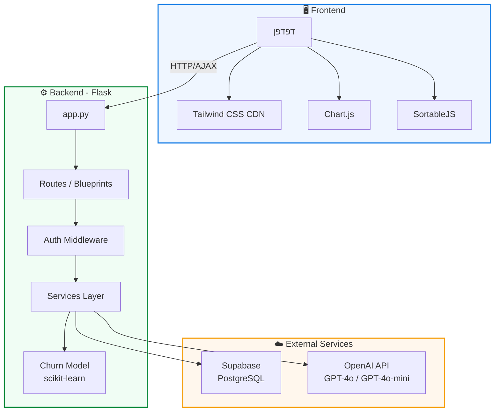
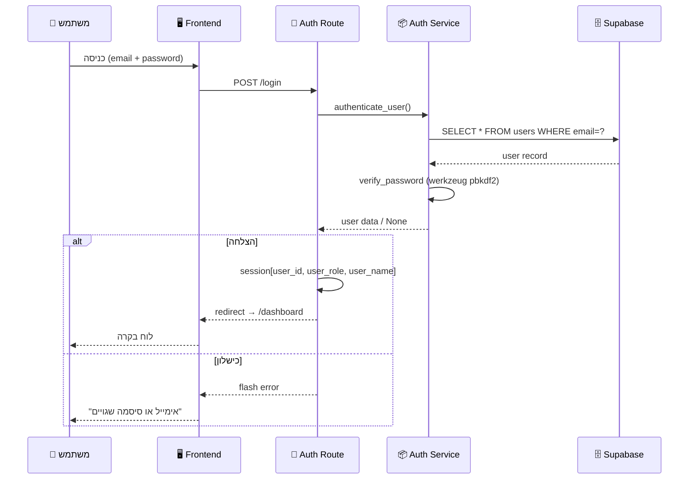
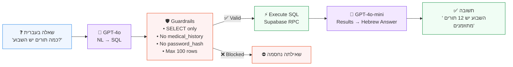
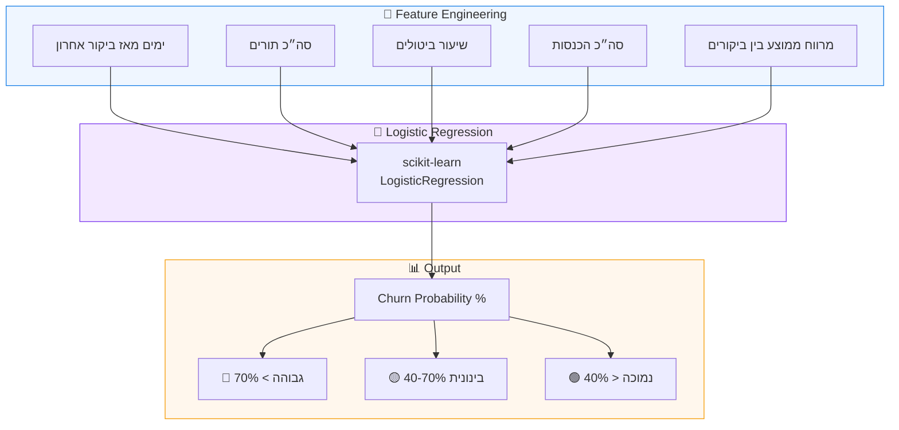
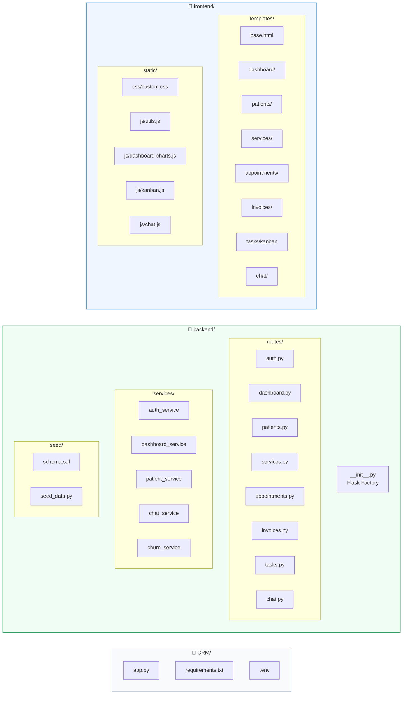
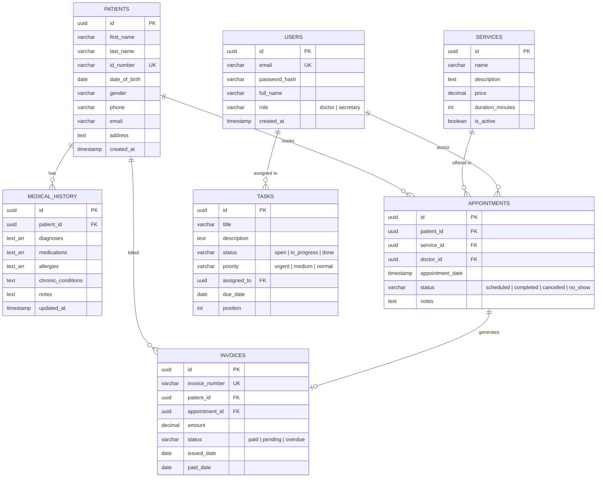
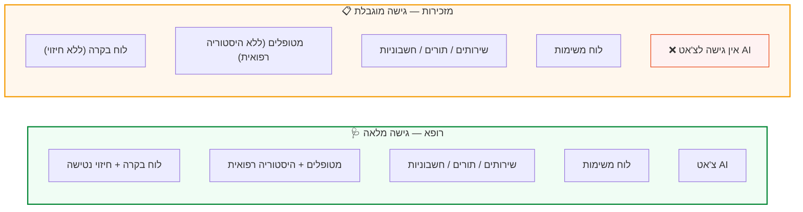
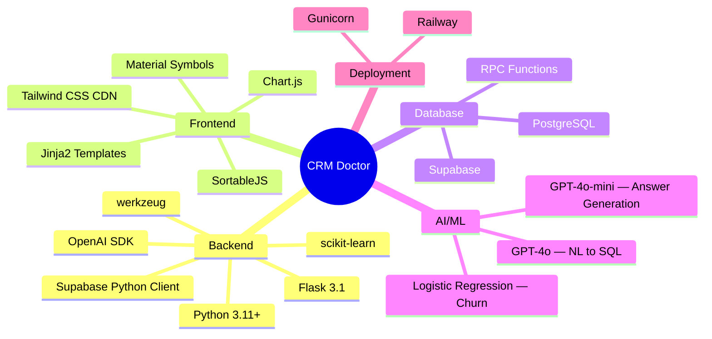

<div align="center">

# 🏥 מערכת CRM למרפאה פרטית

### Doctor Clinic CRM — Full-Stack Demo Application

מערכת ניהול מרפאה חכמה עם בינה מלאכותית, חיזוי נטישת מטופלים וצ'אט RAG

[](https://python.org)
[](https://flask.palletsprojects.com)
[](https://supabase.com)
[](https://openai.com)
[](https://tailwindcss.com)

</div>

---

## 📸 צילומי מסך

<div align="center">

### לוח בקרה ראשי


### פרופיל מטופל + היסטוריה רפואית


### לוח משימות (Kanban)


</div>

---

## 🏗️ ארכיטקטורת המערכת



---

## 🔄 תהליך אימות והרשאות



---

## 🤖 ארכיטקטורת RAG Chat



---

## 📊 מודל חיזוי נטישה (Churn Prediction)



---

## 🗂️ מבנה הפרויקט



---

## 🗄️ סכמת מסד הנתונים (ERD)



---

## ✨ פיצ'רים

| פיצ'ר | תיאור | טכנולוגיה |
|--------|--------|-----------|
| 🔐 **אימות משתמשים** | כניסה עם אימייל/סיסמה, הרשאות לפי תפקיד | Flask Sessions, werkzeug |
| 📊 **לוח בקרה** | 4 כרטיסי KPI, גרף הכנסות, גרף סטטוס תורים | Chart.js |
| 🤖 **חיזוי נטישה** | מודל ML לזיהוי מטופלים בסיכון | scikit-learn |
| 👥 **ניהול מטופלים** | CRUD מלא + פרופיל מפורט + היסטוריה רפואית | Supabase |
| 🩺 **שירותים** | ניהול קטלוג שירותי המרפאה | Supabase |
| 📅 **תורים** | ניהול תורים עם סינון סטטוס | Supabase |
| 💳 **חשבוניות** | ניהול חשבוניות עם סימון תשלום מהיר | Supabase |
| ✅ **לוח משימות** | Kanban עם גרירה בין עמודות | SortableJS |
| 💬 **צ'אט AI** | שאלות בשפה טבעית על נתוני המרפאה | OpenAI GPT-4o RAG |

---

## 👥 תפקידים והרשאות



---

## 🚀 התקנה והפעלה

### דרישות מקדימות
- Python 3.11+
- חשבון [Supabase](https://supabase.com) (חינמי)
- מפתח [OpenAI API](https://platform.openai.com)

### שלבים

```bash
# 1. Clone the repository
git clone https://github.com/YOUR_USERNAME/crm-doctor.git
cd crm-doctor

# 2. Create virtual environment
python -m venv venv
source venv/bin/activate  # Linux/Mac
venv\Scripts\activate     # Windows

# 3. Install dependencies
pip install -r requirements.txt

# 4. Configure environment variables
cp .env.example .env
# Edit .env with your Supabase and OpenAI keys

# 5. Create database tables
# Copy contents of backend/seed/schema.sql
# Paste and run in Supabase SQL Editor

# 6. Populate dummy data
python -m backend.seed.seed_data

# 7. Run the application
python app.py
```

Open [http://localhost:5000](http://localhost:5000) in your browser.

### 🔑 Demo Credentials

| תפקיד | אימייל | סיסמה |
|--------|--------|--------|
| רופא | `doctor@demo.com` | `demo1234` |
| מזכירות | `secretary@demo.com` | `demo1234` |

---

## 🎨 מערכת עיצוב

| Token | ערך | שימוש |
|-------|------|-------|
| 🔵 Primary | `#197fe6` | כפתורים, לינקים, אלמנטים פעילים |
| 🟢 Success | `#078838` | סטטוס חיובי, הושלם, שולם |
| 🟡 Warning | `#f59e0b` | עדיפות בינונית, בהמתנה |
| 🔴 Danger | `#e73908` | דחוף, בוטל, באיחור |
| 📝 Font | Heebo + Manrope | Google Fonts |
| 🎯 Icons | Material Symbols Outlined | Google Fonts |
| 🖼️ UI Framework | Tailwind CSS | CDN |

---

## 🛠️ טכנולוגיות



---

## 📝 רישיון

This project is for **demo purposes only**.

---

<div align="center">

Built with ❤️ using Flask, Supabase, and OpenAI

</div>
